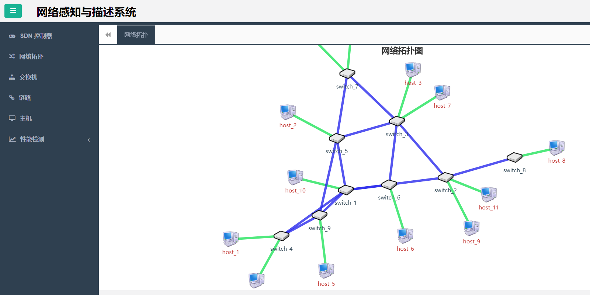
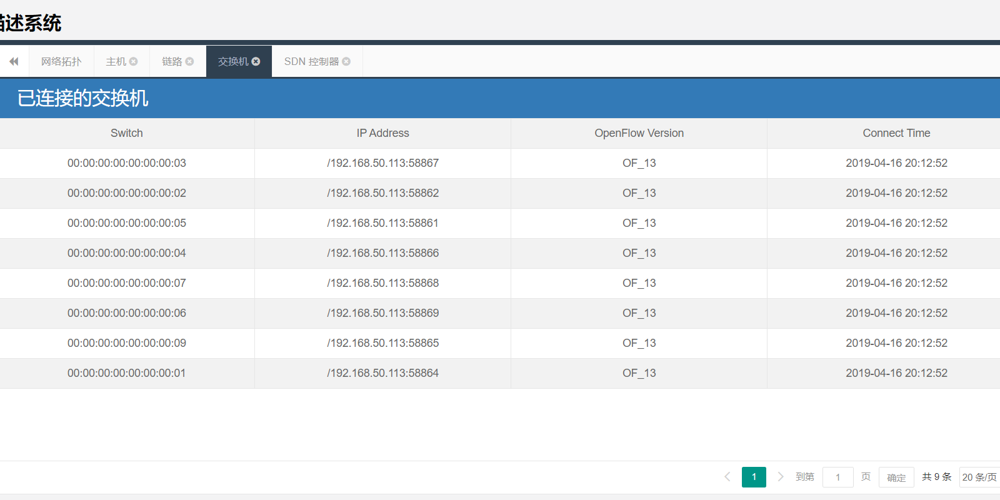
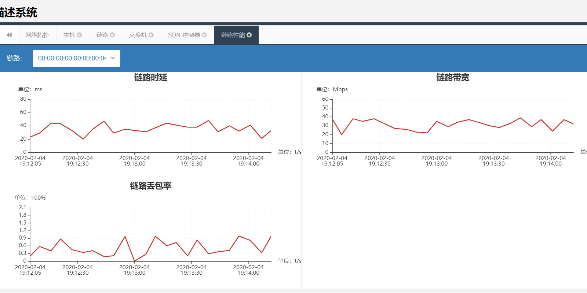

    

semSDN - 基于本体的SDN网络管理系统

- 基于 `Ontology` 的一款 `SDN` 网管系统
- 如果觉得不错 给个 `Star` 支持一下 🤓
## 技术栈
- SpringBoot 核心框架  
- MyBatis 数据访问层  
- ThymeLeaf 模板引擎
- LayUI 前端UI框架
- MySQL 关系型数据库
## 功能介绍
- 网络管理：
## 本地部署
- 客户端配置Constant类中的客户端和服务端地址
- 服务端配置URLConstant类中的SDN控制器Rest API地址
- 服务端启动SDN控制器（ONOS、Floodlight等）
- 服务端启动Mininet网络仿真
- 服务端运行agent项目ONMPServer类
- 客户端运行semanticSDN项目NMApplication类
- 客户端浏览器访问：http://localhost:8080
## 图片演示

